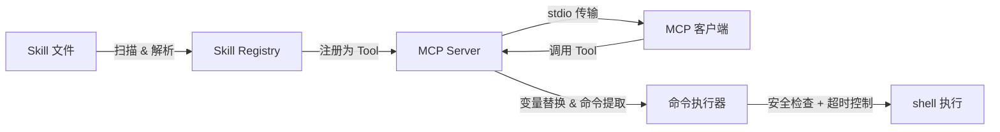

# skill2mcp

[](https://www.npmjs.com/package/skill2mcp)
[](https://opensource.org/licenses/MIT)

将 Claude Code Skills 转换为 MCP (Model Context Protocol) 服务，让任何支持 MCP 的 AI 客户端都能发现和使用本地 Skill。

## 特性

- **自动扫描** — 自动发现 `.claude/skills` 和 `.claude/commands` 目录下的 Skill 文件
- **Skill → MCP Tool** — 每个 Skill 自动注册为独立的 MCP Tool，支持参数传递和变量替换
- **命令执行** — 提取并执行 Skill 中的 shell 命令（代码块 `` ```!bash `` 和内联 `` !`cmd` ``）
- **安全防护** — 内置危险命令黑名单、命令超时机制
- **通用 run_command** — 可选的通用命令执行 Tool，支持开关控制
- **零配置** — 默认配置即可工作，通过环境变量灵活定制

## 快速开始

### 安装

```bash
# 使用 npx 直接运行（无需安装）
npx skill2mcp

# 或全局安装
pnpm add -g skill2mcp
skill2mcp
```

### 在 MCP 客户端中配置

以 Claude Code 为例，在 `.claude/settings.json` 中添加：

```json
{
  "mcpServers": {
    "skill2mcp": {
      "command": "npx",
      "args": ["skill2mcp"],
      "env": {
        "SKILL2MCP_WORKDIR": "/path/to/your/project"
      }
    }
  }
}
```

配置完成后，MCP 客户端将自动发现指定目录下的所有 Skill 并将其暴露为可调用的 Tool。

## 配置

通过环境变量进行配置：

| 环境变量 | 说明 | 默认值 |
|----------|------|--------|
| `SKILL2MCP_SKILL_DIRS` | Skill 搜索目录，多个目录用 `:` 分隔 | `.claude/skills:.claude/commands` |
| `SKILL2MCP_TIMEOUT` | 命令执行超时时间（毫秒） | `30000`（30 秒） |
| `SKILL2MCP_WORKDIR` | 工作目录，相对路径的基准目录 | 当前工作目录 |
| `SKILL2MCP_ENABLE_RUN_COMMAND` | 是否启用通用 `run_command` Tool | `true`（启用） |

## 工作原理



1. **扫描** — 递归扫描配置的 Skill 目录，解析 Markdown 文件的 frontmatter 和正文
2. **注册** — 将每个 Skill 注册为独立的 MCP Tool，名称由目录/文件名派生
3. **执行** — 当 Tool 被调用时，替换变量（`$ARGUMENTS`、`${CLAUDE_SKILL_DIR}`），提取 shell 命令并执行，将结果替换回正文返回

## Skill 格式

### 目录结构

支持两种目录布局：

```
.claude/
├── skills/                    # Skill 目录格式
│   └── my-skill/              # 每个 Skill 一个子目录
│       └── SKILL.md           # Skill 定义文件
└── commands/                  # Command 目录格式（兼容）
    └── my-command.md          # 每个 Command 一个 Markdown 文件
```

### Frontmatter 字段

Skill 文件使用 YAML frontmatter 定义元数据：

```markdown
---
description: "执行项目构建"
argument-hint: "<target>"
when_to_use: "需要构建项目时使用"
allowed-tools: ["Bash", "Read"]
shell: bash
---

## 构建说明

执行以下命令构建项目：

\`\`\`!bash
pnpm run build
\`\`\`
```

| 字段 | 类型 | 说明 |
|------|------|------|
| `description` | `string` | Skill 描述，用作 MCP Tool 的描述 |
| `argument-hint` | `string` | 参数提示，如 `<file-path>` |
| `when_to_use` | `string` | 使用场景说明 |
| `allowed-tools` | `string[]` | 允许使用的工具列表 |
| `shell` | `string` | Shell 类型 |

### 变量替换

Skill 正文中支持以下变量：

| 变量 | 说明 |
|------|------|
| `$ARGUMENTS` | 用户传入的完整参数字符串 |
| `$0`, `$1`, `$2` ... | 参数按空格分割后的各部分 |
| `${CLAUDE_SKILL_DIR}` | Skill 所在目录的绝对路径 |

### 命令格式

在正文中使用以下格式定义要执行的 shell 命令：

**代码块格式：**

````markdown
```!bash
pnpm run build
```
````

**内联格式：**

```markdown
当前版本: !`cat package.json | grep version`
```

## 安全措施

- **危险命令黑名单** — 自动拦截 `rm -rf /`、`mkfs`、`dd`、`shutdown`、`reboot` 等破坏性命令
- **命令超时** — 默认 30 秒超时，超时后自动终止子进程
- **spawn 安全** — 使用 `child_process.spawn` 传入数组参数，避免 shell 注入
- **run_command 开关** — 通用命令执行 Tool 可通过 `SKILL2MCP_ENABLE_RUN_COMMAND=false` 禁用

## 项目结构

```
src/
├── bin.ts          # CLI 入口
├── index.ts        # 公共 API 导出
├── config.ts       # 配置解析（环境变量 + 默认值）
├── scanner.ts      # Skill 文件扫描与 frontmatter 解析
├── registry.ts     # MCP Tool 注册（Skill → Tool 映射）
├── executor.ts     # 命令提取、变量替换、安全执行
├── server.ts       # MCP Server 创建与启动
├── types.ts        # 类型定义
└── __tests__/      # 测试文件
```

## 开发

```bash
# 安装依赖
pnpm install

# 开发模式（watch）
pnpm run dev

# 构建
pnpm run build

# 测试
pnpm run test

# 测试覆盖率
pnpm run test:coverage

# 代码检查
pnpm run lint

# 类型检查
pnpm run typecheck

# 完整检查（typecheck + lint）
pnpm run check
```

## 许可证

[MIT](LICENSE) © 2026 shenjingnan
